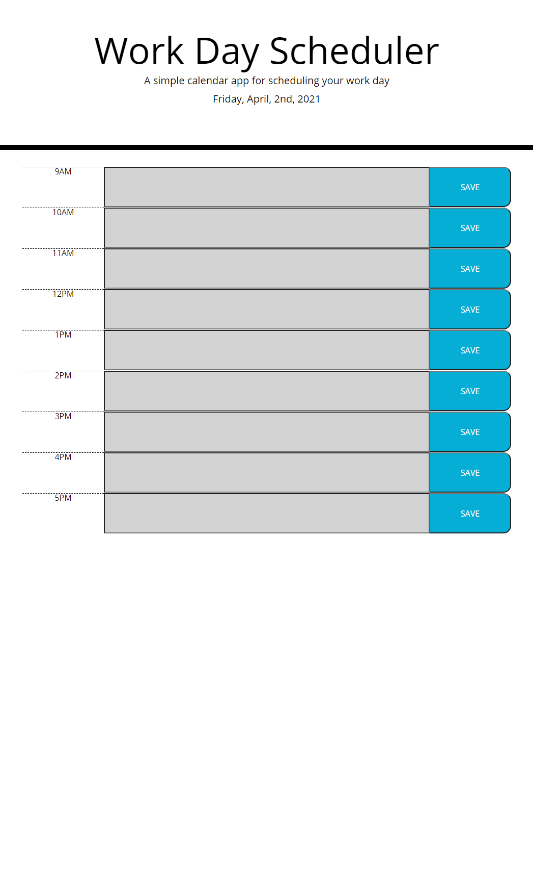

# Work-Day-Scheduler

## Site Picture


## Technologies Used
    - Javascript - Used to make the web page interactive and store data.
    - Git - Version control system to track changes to source code.
    - GitHub - Hosts repository that can be deployed to GitHub pages.

## Summary
    - Here I constructed this web page that allows you to plan for you work day, you can type anything in the input and it will save. For this I was given an empty web and some css styling. I large majority of my work was done in javascript.


## Code Snippet
    - Here in this code snippet is my for loop that stores data and changes the color attribute depending on what time it is.
```javascript
for (var i = 0; i < timesheet.children.length; i++) {
        var timeInputId = timesheet.children[i].id + '_input';
        var timeInput = document.getElementById(timeInputId);
        var userInput = localStorage.getItem(timeInputId)

        timeInput.value = userInput

        timesheetTime = moment(timesheet.children[i].id, 'ha')

        if (moment(currentHour).isBefore(timesheetTime)) {
            timeInput.classList.add('future');
        }
        else if (moment(currentHour).isAfter(timesheetTime)) {
            timeInput.classList.add('past');
        }
        else {
            timeInput.classList.add('present');
        }
    }
```

## Author Links
[LinkedIn](https://www.linkedin.com/in/liamsctewart/)<br>
[Github](https://github.com/LiamStewart8)<br>
[Deployed Link](https://liamstewart8.github.io/Work-Day-Scheduler/)